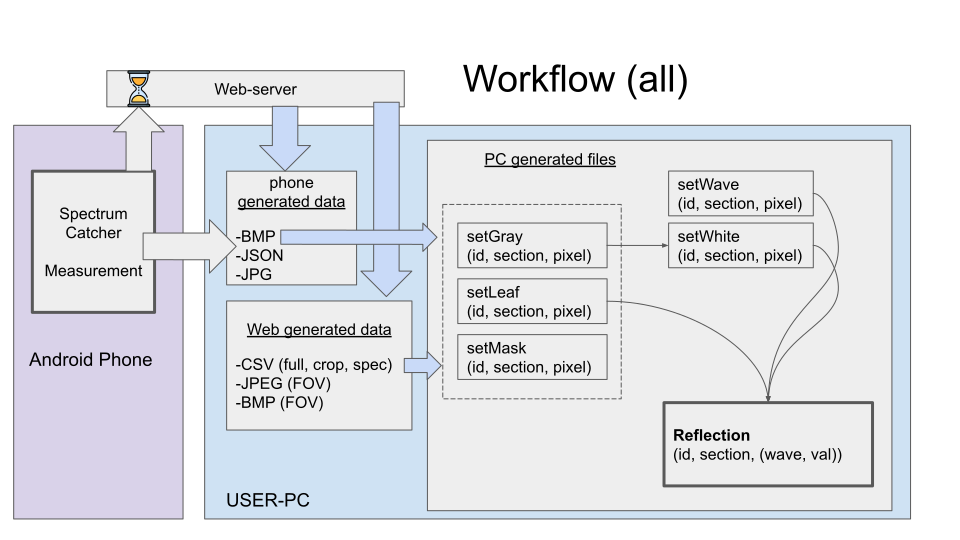

# README

## spectrumCatcher

This is a Python library for downloading & analyzing Spectrum Catcher Data with Python.

[PYPI](https://pypi.org/project/spectrumCatcher/)

## 1. Installation

* option 1: `pip install spectrumCatcher`
* option 2: \(after downloading this repo and extract\) `python setup.py install`
* option 3: \(after downloading this repo and extract\)

  `pip install dist/spectrumCathcer-0.1.0-py3-none-any.whl`

## 2. Usage

### 2.1. Downloading from the Web-server:

```text
>>> from spectrumCatcher import downloader
>>> d = downloader.Downloader("username", "password", "2020-03-26","path/for/downloaded/data")
>>> Types = {
        "origRGB"  : True,
        "json"     : True,
        "rawBMPs"  : True,
        "CSVfull"  : True,
        "CSVcrop"  : True,
        "CSVspec"  : True,
        "RGBwithPOV": True,
        "BMPwithPOV": True}
>>> d.setWhichFiles(Types)
>>> d.processHTML()
>>> d.download_set()
```

### 2.2. Copying from the Phone

```text
>>> c = Copier('192.168.11.4')
>>> c.downloadHTML()
>>> c.processHTML(display = True)
>>> c.download1day('20201111')
```




